<!-- ═══════════════════════════════════════════════════════════ -->
<!--                AYUSH — GitHub Profile README                -->
<!-- ═══════════════════════════════════════════════════════════ -->

<div align="center">

# ⚡ `[ ~/ayush-kunwar-singh ]`
**Systems Engineer &nbsp;|&nbsp; Competitive Programmer &nbsp;|&nbsp; Full-Stack Dev**

<br/>

_Mounting+scalable_architecture.go...;>_Compiling+competitive_macros.cpp...;>_Starting+WebRTC_server.js...;>_Establishing+bare-metal+OS+connections...;>_System_Ready." alt="Boot Sequence Typing SVG" />

<br/><br/>

<table align="center" style="border-collapse: collapse; border: none;">
  <tr style="border: none;">
    <td align="center" style="border: none; padding: 0 5px;">
      <a href="https://komarev.com/ghpvc/?username=block-plant">
        
      </a>
    </td>
    <td align="center" style="border: none; padding: 0 5px;">
      
    </td>
    <td align="center" style="border: none; padding: 0 5px;">
      
    </td>
    <td align="center" style="border: none; padding: 0 5px;">
      
    </td>
  </tr>
</table>

</div>

<br/>


---


## 💠 `[ SYSTEM_ARCHITECTURE // WHOAMI ]`

```yaml
# /etc/ayush/sys_config.yml
IDENTITY:
  user: "Ayush Kunwar Singh"
  base: "MNNIT Allahabad [2nd Yr B.Tech]"
  roles: 
    - "Systems Architect"
    - "Competitive Programmer"
    - "Full-Stack Developer"
  mission: "Bridging bare-metal hardware logic with global-scale web architecture."

KNOWLEDGE_TREE:
  Languages: [ "C++", "C", "Go", "Java", "Python", "JavaScript", "TypeScript" ]
  Core_Subjects: [ "OOP", "DBMS", "Computer Networks", "Distributed Systems", "OS", "System Design", "Cryptography" ]
  Web_Engine: [ "React", "Next.js", "Node.js", "Docker", "REST APIs", "WebSockets", "AI Integrations", "WebRTC", "Tailwind CSS" ]
  Databases_Cloud: [ "SQL", "MySQL", "MongoDB", "Firebase", "Supabase", "B-Trees", "WAL" ]
  Creative_AI: [ "Three.js", "Framer Motion", "GLSL Shaders", "Machine Learning", "Neural Networks", "TensorFlow", "PyTorch" ]
  Low_Level: [ "Linux CLI", "Git", "ESP32", "Bare-Metal", "TCP/IP Sockets" ]
```

```mermaid
flowchart LR
    %% ROOT NODE
    subgraph NODE_0 [MASTER CONTROL]
        direction TB
        USER(Ayush Kunwar Singh)
    end

    %% CLUSTER 1: CORE ARCHITECTURE & LANGUAGES
    subgraph CLUSTER_1 [LOW-LEVEL & CORE ARCHITECTURE]
        direction TB
        C1(System Design)
        C2(Computer Networks & TCP/IP)
        C3(Distributed Systems)
        C4(OOP & Relational DBMS)
        C5(C++ & C)
        C6(Go)
        C7(Java & Python)
        C8(Linux & ESP32 Bare-Metal)
    end

    %% CLUSTER 2: MASSIVE FULL-STACK WEB ENGINE
    subgraph CLUSTER_2 [FULL-STACK WEB ENGINE]
        direction TB
        W1(React.js, Next.js & TS)
        W2(Node.js, Express & REST)
        W3(Docker & Containerization)
        W4(AI API Integrations)
        W5(WebRTC & WebSockets)
        W6(Firebase & Supabase)
        W7(SQL & NoSQL Ecosystem)
        W8(Tailwind CSS & UI/UX)
    end
    
    %% CLUSTER 3: CREATIVE DEV & A.I. MATRIX
    subgraph CLUSTER_3 [CREATIVE CODE & A.I. MATRIX]
        direction TB
        A1(Three.js & WebGL)
        A2(GLSL Shaders)
        A3(Framer Motion & GSAP)
        A4(Machine Learning)
        A5(Neural Networks)
        A6(TensorFlow & PyTorch)
    end

    %% CONNECTIONS
    NODE_0 ==>|Architects| CLUSTER_1
    NODE_0 ==>|Deploys| CLUSTER_2
    NODE_0 ==>|Trains & Renders| CLUSTER_3

    %% LINK STYLING (Forces black text on the connection arrows for maximum clarity)
    linkStyle 0,1,2 stroke:#90E0EF,stroke-width:2px,color:#000000,font-weight:900;

    %% INTERACTIVITY: CLICK EVENTS & HOVER TOOLTIPS
    click C1 "[https://github.com/topics/system-design](https://github.com/topics/system-design)" "Designing scalable, fault-tolerant systems"
    click C2 "[https://github.com/topics/computer-networking](https://github.com/topics/computer-networking)" "TCP/IP, Cryptography, and packet routing"
    click C3 "[https://github.com/topics/distributed-systems](https://github.com/topics/distributed-systems)" "Master/Child nodes and eventual consistency"
    click C4 "[https://github.com/topics/dbms](https://github.com/topics/dbms)" "B-Trees, WAL, ACID properties, and relational algebra"
    click C5 "[https://github.com/topics/cpp](https://github.com/topics/cpp)" "Primary weapon for Competitive Programming"
    click C6 "[https://github.com/topics/go](https://github.com/topics/go)" "High-performance systems engineering"
    click C8 "[https://github.com/topics/esp32](https://github.com/topics/esp32)" "Bare-metal programming and hardware interfacing"

    click W1 "[https://github.com/topics/react](https://github.com/topics/react)" "Component-driven user interfaces and SSR"
    click W2 "[https://github.com/topics/nodejs](https://github.com/topics/nodejs)" "Asynchronous event-driven backend services"
    click W3 "[https://github.com/topics/docker](https://github.com/topics/docker)" "Isolated application environments and deployment pipelines"
    click W4 "[https://github.com/topics/artificial-intelligence](https://github.com/topics/artificial-intelligence)" "Connecting LLMs and AI logic to frontend interfaces"
    click W5 "[https://github.com/topics/webrtc](https://github.com/topics/webrtc)" "Sub-100ms latency peer-to-peer streaming"
    click W6 "[https://github.com/topics/firebase](https://github.com/topics/firebase)" "Real-time state synchronization and cloud auth"
    click W7 "[https://github.com/topics/sql](https://github.com/topics/sql)" "Complex querying and data modeling"

    click A1 "[https://github.com/topics/threejs](https://github.com/topics/threejs)" "3D rendering and spatial audio"
    click A2 "[https://github.com/topics/glsl](https://github.com/topics/glsl)" "Custom rendering pipelines and post-processing"
    click A4 "[https://github.com/topics/machine-learning](https://github.com/topics/machine-learning)" "Regression, classification, and data modeling"
    click A5 "[https://github.com/topics/neural-network](https://github.com/topics/neural-network)" "Deep learning architectures"

    %% HUD STYLING CLASSES
    classDef master fill:#03045E,stroke:#00B4D8,stroke-width:2px,color:#fff
    classDef arch fill:#0077B6,stroke:#00B4D8,color:#fff
    classDef web fill:#0096C7,stroke:#90E0EF,color:#fff
    classDef ai fill:#B45309,stroke:#F59E0B,color:#fff
    classDef cluster fill:#0d1117,stroke-width:1px,stroke-dasharray: 5 5,color:#fff
    
    %% APPLY STYLES
    class NODE_0 master
    class USER master
    
    class CLUSTER_1 cluster
    style CLUSTER_1 stroke:#00B4D8
    class C1,C2,C3,C4,C5,C6,C7,C8 arch

    class CLUSTER_2 cluster
    style CLUSTER_2 stroke:#90E0EF
    class W1,W2,W3,W4,W5,W6,W7,W8 web

    class CLUSTER_3 cluster
    style CLUSTER_3 stroke:#F59E0B
    class A1,A2,A3,A4,A5,A6 ai
```



<br/>
---

## 🛠️ Tech Universe


<div align="center">

### 🖥️ Languages


### 🎨 Frontend


### ⚙️ Backend & Databases


### 🛠️ Tools & Environment


</div>


---


## ⚔️ Competitive Programming


<div align="center">


<table width="100%" border="0" cellspacing="0" cellpadding="10">

<tr>

  <td width="33%" align="center" valign="top">


**LeetCode** &nbsp;·&nbsp; [`AkunwarS`](https://leetcode.com/u/AkunwarS/)


  </td>

  <td width="33%" align="center" valign="top">


**Codeforces** &nbsp;·&nbsp; [`block-plant`](https://codeforces.com/profile/block-plant)


  </td>

  <td width="33%" align="center" valign="top">


**CodeChef** [`block_plant`](https://www.codechef.com/users/block_plant)


<!-- FIX: cp-logo.vercel.app is dead — using a styled badge instead -->

<a href="https://www.codechef.com/users/block_plant">

  

</a>


  </td>

</tr>

</table>


<br/>


<a href="https://leetcode.com/u/AkunwarS/">

  

</a>

<a href="https://codeforces.com/profile/block-plant">

  

</a>


<a href="https://www.codechef.com/users/block_plant">

  

</a>


</div>


---


## 🚀 Featured Work


### ⚒️ [Forge: Multi-Tenant Backend-as-a-Service](https://github.com/block-plant/Forge)


<!-- FIX: github-readme-stats pin cards are unreliable — using gh-card.dev instead -->

<a href="https://github.com/block-plant/Forge">

  

</a>


**A production-grade BaaS built entirely from scratch in Go.**  

*Zero external dependencies (no `net/http`, no Postgres). Every byte understood.*


Forge is a complete Firebase/Supabase alternative engineered from first principles. It powers entire application ecosystems from a single server by dynamically spawning isolated project environments.


🔹 **Core Engine:** Hand-rolled TCP listener & HTTP/1.1 parser. Custom RFC 6455 WebSocket implementation.<br/>

🔹 **Database & Storage:** Custom NoSQL Document store with an in-memory B-Tree and Write-Ahead Log (WAL) for ACID persistence.<br/>

🔹 **Architecture:** Master/Child multi-tenant node provisioning natively utilizing Linux `systemd` daemon management.<br/>

🔹 **Security:** Custom Domain-Specific Language (DSL) with a hand-written lexer/parser/AST evaluator for declarative security rules.


<br/>


   


<br clear="both"/>


---


### 🌉 [LoveBridge: Real-Time Communication Platform](https://github.com/your-username/LoveBridge)


<!-- FIX: github-readme-stats pin cards are unreliable — using gh-card.dev instead -->

<a href="https://github.com/block-plant/bridge">

  

</a>


**A production-deployed full-stack application for real-time communication.**  

*Sub-100ms latency peer-to-peer streaming. Fully synchronized state.*


LoveBridge is a comprehensive WebRTC and Firebase platform engineered for seamless connectivity. It powers a synchronized media room, instant messaging, and collaborative planning tools through a highly responsive, PWA-enabled interface.


🔹 **Core Engine:** WebRTC architecture achieving sub-100ms latency for peer-to-peer video streaming and real-time interactions.<br/>

🔹 **Backend & Data:** Firebase Authentication and Firestore for secure, instantaneous global state synchronization and serverless logic.<br/>

🔹 **Frontend Architecture:** Component-driven UI developed with React.js and Vite, utilizing Tailwind CSS for utility-first responsiveness.<br/>

🔹 **Resilience:** Progressive Web App (PWA) capabilities paired with custom offline detection modules to handle network degradation gracefully.


<br/>


   


<br clear="both"/>


---


### 🌌 [Xenova Archive: Digital Mausoleum of a Lost Empire](https://github.com/block-plant/xenova-archive)


<!-- FIX: github-readme-stats pin cards are unreliable — using gh-card.dev instead -->

<a href="https://github.com/block-plant/xenova-archive">

  

</a>


**An immersive, lore-heavy digital experience — part 3D gallery, part interactive narrative, part gamified terminal.**  

*Chronicling the rise and fall of a civilization that forgot how to die.*


🔹 **Interstellar Map:** 14 planets rendered with custom GLSL shaders, atmospheric scattering, procedural ring systems & spatial audio.<br/>

🔹 **Void Vault:** 3D relic viewer with post-processing glitch effects and chromatic aberration for recovered Strain Omega artifacts.<br/>

🔹 **Codex Decoder:** Bi-directional human ↔ Xenovan glyph translator; each decoded entry unlocks a fragment of the "Great Mistake" narrative.<br/>

🔹 **Three Eras:** Discovery (The Harvest) → Ascension (The Synthetic God) → Great Mistake (The Silence).


<br/>


    


<br clear="both"/>


---


### ⚡ [slave-cp: High-Performance Competitive Programming CLI](https://github.com/block-plant/slave-cp)


<!-- FIX: github-readme-stats pin cards are unreliable — using gh-card.dev instead -->

<a href="https://github.com/block-plant/slave-cp">

  

</a>


**A robust CLI automation engine that streamlines the end-to-end competitive programming workflow.**  

*No browser. No WebDriver. Pure terminal — from fetch to verdict.*


🔹 **Scraping Engine:** Cloudflare Turnstile bypass via `cloudscraper` — headless extraction of contest metadata & sample test cases without touching a browser.<br/>

🔹 **Headless Submission:** Cookie-based `JSESSIONID` session management replacing Selenium entirely — **90% lower submission latency** with zero WebDriver overhead.<br/>

🔹 **Modular Pipeline:** Decoupled Fetcher → Runner → Submitter architecture; real-time JSON polling for judge verdicts via a headless REST layer.<br/>

🔹 **23+ Languages:** Dynamic cross-platform execution engine managing compilers & interpreters from C++ and Rust to Haskell — with Rich-powered diff tables for test output.


<br/>


    


<br clear="both"/>


---


## 🏅 Achievements


<div align="center">


<table width="100%" border="0" cellspacing="0" cellpadding="10">

<tr>

  <td align="center" width="60px">🥉</td>

  <td><strong>3rd</strong><br/><sub>Cybertron Web Forge at Botrush 4.0</sub></td>

  <td align="right"><sub>Mon 2026</sub></td>

</tr>

</table>


</div>


---


## 🤝 Connect


<div align="center">


<a href="https://www.linkedin.com/in/ayush-kunwar-singh-226502390/">

  

</a>

<a href="https://leetcode.com/u/AkunwarS/">

  

</a>

<a href="https://codeforces.com/profile/block-plant">

  

</a>

<a href="https://www.codechef.com/users/block_plant">

  

</a>


<br/><br/>


> *"जीवन में कोई चीज़ इतनी बड़ी मत समझो कि वो तुम्हें डरा सके।"*

> — APJ Abdul Kalam


</div>


<div align="center">


</div>
